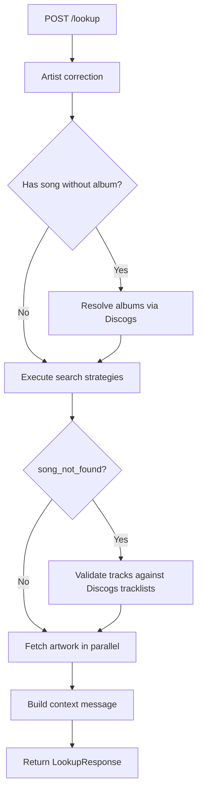
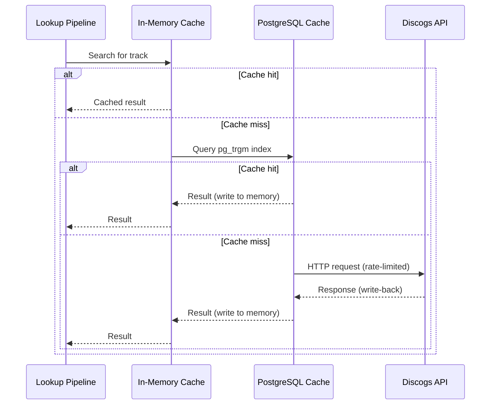

# Library Metadata Lookup: Technical Overview

WXYC's request pipeline receives song requests from listeners via Slack -- partial, misspelled, and ambiguous. A listener might type "play Your Dreams by Sarah Louise" or "Guerilla Toss - Betty Dreams of Green Men" or just "Deee-Lite". Each of these needs to become a specific album in the station's library catalog so DJs can find and play it.

The catalog has ~30,000 entries with decades of inconsistent data entry. Diacritics are sometimes present, sometimes not (Jorgen Plaetner vs Jørgen Plaetner). Compilations are filed under "Various" or the original artist depending on who cataloged the CD. Album titles don't always match the spelling on Discogs or the physical sleeve.

Naive full-text search fails on all of this:

- **Diacritics**: A query for "jorgen plaetner" misses entries filed under "Jørgen Plaetner"
- **Missing album**: A search for "Your Dreams" with no album returns nothing unless the system can figure out it's on "Earth Bow"
- **Ambiguous format**: "Guerilla Toss - Betty Dreams of Green Men" might mean artist "Guerilla Toss" with song "Betty Dreams of Green Men", or the reverse
- **Compilations**: A song on "Said I Had a Vision" won't appear under Brown Sugar Inc, who performed it
- **Typos**: "lucinda willias" needs to find "Lucinda Williams" (a real typo from the WXYC playlist)
- **Parser errors**: An AI parser might classify "Deee-Lite" as a song title instead of an artist name

Previously, the logic to handle all of this was entangled with message parsing and Slack posting in request-o-matic. Extracting it into a standalone service made each concern testable and deployable independently.

## Solution

Library Metadata Lookup is a FastAPI service that accepts pre-parsed fields (artist, song, album) and returns enriched library results with Discogs artwork. It solves the accuracy problem through layered fallbacks at every level of the stack:

- **4 search strategies** tried in priority order, each targeting a different class of ambiguity
- **3-level library fallback** chain (FTS5 -> LIKE -> fuzzy) so queries always find something
- **Diacritics normalization** via NFKD decomposition, handling catalog inconsistencies for artists like Jørgen Plaetner, Anaïs Mitchell, and Motörhead
- **Compilation cross-referencing** via Discogs tracklists, finding songs filed under "Various Artists"
- **3-tier Discogs caching** (in-memory -> PostgreSQL -> API) keeping response times low despite the 2-22 API calls a single uncached lookup can require

## The lookup pipeline

A single call to `perform_lookup()` passes through six steps. Each step can short-circuit or enrich the data for the next.

| Step | What it does | Key function |
|------|-------------|--------------|
| 1. Artist correction | Fuzzy-match artist against catalog to fix typos | `LibraryDB.find_similar_artist()` |
| 2. Album resolution | If song provided without album, ask Discogs which albums contain it | `resolve_albums_for_track()` |
| 3. Strategy execution | Run search strategies in order until results found | `execute_search_pipeline()` |
| 4. Track validation | If fallback returned all artist albums, validate each against Discogs tracklists | `filter_results_by_track_validation()` |
| 5. Artwork fetch | Fetch album art from Discogs for each result (parallel) | `fetch_artwork_for_items()` |
| 6. Context message | Generate human-readable summary of what happened | `build_context_message()` |

Artist correction (step 1) uses `rapidfuzz.fuzz.ratio()` with an 85-point threshold. It pulls candidates from the catalog by prefix (first 3 characters of the first significant word) and returns the best match above threshold. This catches "lucinda willias" -> "Lucinda Williams" and "Anais Mitchel" -> "Anais Mitchell" without being so loose that it creates false corrections.

Album resolution (step 2) only triggers when a song is provided without an album. It queries Discogs for releases containing that track, deduplicates album names, and feeds them into the strategy pipeline. This transforms a vague "play Your Dreams by Sarah Louise" into a targeted search for "Earth Bow" in the catalog.

## Search strategy pattern

Strategies are defined declaratively in `core/search.py` using a `SearchStrategy` dataclass. Each strategy has four fields: a `name` (enum for telemetry), a `condition` function (pure, no I/O) that decides whether the strategy should run, an async `execute` function that performs the search, and flags indicating whether the strategy updates `song_not_found` or `discogs_titles` state.

The `execute_search_pipeline()` loop iterates through strategies in array order, checking each condition against a `SearchState` accumulator. `SearchState` tracks results, flags (`song_not_found`, `found_on_compilation`), the list of strategies tried (for telemetry), Discogs title overrides (for artwork lookup), and album names resolved from Discogs track lookup.

| Strategy | Condition | What it does |
|----------|-----------|-------------|
| `ARTIST_PLUS_ALBUM` | Has artist, album, or song | Search library by artist + album/song, falling back to artist-only |
| `SWAPPED_INTERPRETATION` | No results + ambiguous "X - Y" format | Try both orderings: X as artist or Y as artist |
| `TRACK_ON_COMPILATION` | Song not found + has artist and song | Cross-reference Discogs tracklists to find song on compilations |
| `SONG_AS_ARTIST` | No results + song but no artist | Try parsed song as artist name (handles AI parser misinterpretation) |

The first strategy that produces results wins -- with one exception. If `ARTIST_PLUS_ALBUM` finds results but had to fall back to artist-only (setting `song_not_found=True`), the pipeline continues. `TRACK_ON_COMPILATION` can then upgrade those results by finding the actual album the song appears on. This means a request for "Sweet Love of Mine by Brown Sugar Inc" that initially returns all Brown Sugar Inc albums can be narrowed to just "Said I Had a Vision", the compilation that contains the track.

`SWAPPED_INTERPRETATION` handles the inherent ambiguity of "X - Y" formatted messages. When the AI parser sees "Guerilla Toss - Betty Dreams of Green Men", it guesses which part is the artist and which is the title. If the first guess produces no results, this strategy uses `detect_ambiguous_format()` to extract both parts and tries both orderings against the library.

`SONG_AS_ARTIST` catches a subtler parser failure. When a listener types just an artist name ("Deee-Lite"), the parser sometimes misclassifies it as a song title with no artist. This strategy tries the parsed song field as an artist name in the library, recovering results that would otherwise be lost.

The declarative pattern keeps strategy logic testable in isolation. Condition functions are pure, execute functions are injected via `build_strategies()`, and the pipeline handles ordering and state management. Adding a new strategy means defining a condition, an execute function, and inserting a `SearchStrategy` into the array at the right position.

## Library search fallback chain

Within the `ARTIST_PLUS_ALBUM` strategy, the library search itself has three levels. Each level handles a different class of failure.

**Level 1: FTS5.** SQLite's full-text search engine. A `JOIN` against the `library_fts` virtual table matches the query using FTS5's built-in tokenizer and ranking. This is the happy path for well-formed queries like "velocity girl sympatico" -- fast, precise, with relevance-ranked results. It fails on special characters (parentheses in album titles break FTS syntax) and on queries where diacritics don't match the indexed form.

**Level 2: LIKE.** When FTS returns nothing or throws a syntax error, the query is normalized (diacritics stripped, lowercased), then decomposed into individual words. Stopwords ("the", "a", "and", "play", "song", "remix", "records", and others) are filtered out, and words shorter than 2 characters are dropped. The remaining words become AND-chained `LIKE` conditions: each word must appear in either the artist or title column. This handles FTS edge cases -- a query with parentheses that breaks FTS syntax, or an accented character that the FTS index doesn't match. The tradeoff is no ranking: results come back in table order.

**Level 3: Fuzzy.** When LIKE also returns nothing, the system pulls up to 500 candidates from the catalog using a 3-character prefix of the longest query word, then scores each candidate against the full query using `rapidfuzz.fuzz.token_set_ratio()`. This scoring function compares the set of tokens in both strings, ignoring order and duplicates, which makes it resilient to word transposition ("Alice Gerrard Hazel Dickens" vs "Hazel Dickens Alice Gerrard"). Results scoring 70 or above (on a 0-100 scale) are returned, sorted by score descending. This catches typos and transpositions that neither FTS nor LIKE can handle -- "lucinda willias" still matches "Lucinda Williams" because enough tokens overlap.

The three levels cascade automatically via flags on `LibraryDB.search()`: `fallback_to_like` and `fallback_to_fuzzy` default to `True`, so callers get the full chain by default. Individual levels can be disabled when the caller needs more control (e.g., the compilation search disables fuzzy to avoid false positives).

### Diacritics normalization

All three levels normalize queries via NFKD decomposition (`unicodedata.normalize("NFKD", text)`) followed by filtering of Unicode combining marks. This maps accented characters to their base forms: "Jorgen Plaetner" matches "Jørgen Plaetner", "Anais Mitchell" matches "Anaïs Mitchell", "Motorhead" matches "Motörhead".

The catalog is inconsistent about whether accented characters are present -- the same artist may be entered with or without diacritics depending on who cataloged the CD. Normalization is applied to both the query and the comparison target (via `normalize_for_comparison()`), so mismatches in either direction are handled.

## Three-tier Discogs caching

The service queries Discogs for album resolution, track validation, artwork, and compilation cross-referencing. Without caching, a single lookup can require 2-22 API calls against a rate limit of 60/minute. Three cache tiers keep repeat queries fast and stay well under the rate limit.

**Tier 1: In-memory TTL cache.** Three `cachetools.TTLCache` instances, each tuned for its access pattern:

| Cache | TTL | Max entries | What it stores |
|-------|-----|-------------|----------------|
| Track cache | 1 hour | 1,000 | `search_releases_by_track()` results |
| Release cache | 4 hours | 500 | `get_release()` metadata |
| Search cache | 1 hour | 1,000 | `search()` artwork results |

The `@async_cached` decorator generates deterministic MD5 keys from function name and arguments, checks the cache before calling the wrapped function, and skips `None` results. On cache hits, it sets a `cached=True` flag on Pydantic response models so callers (and telemetry) know the result was served from memory.

A per-request `ContextVar` flag (`skip_cache`) allows bypassing all caches for benchmarking and A/B comparisons without code changes. This is exposed as a `skip_cache` query parameter on `POST /lookup`.

**Tier 2: PostgreSQL cache.** An `asyncpg` connection pool queries the same database populated by the [discogs-cache](https://github.com/WXYC/discogs-cache) ETL pipeline. Fuzzy text search uses PostgreSQL's `pg_trgm` extension with GIN indexes -- the `%` trigram operator matches artist and track names even with spelling variations. On API fetch (tier 3), results are written back to PostgreSQL via `ON CONFLICT DO UPDATE` (UPSERT) so subsequent requests hit the cache.

This tier is optional. If `DATABASE_URL_DISCOGS` is not set, the service gracefully degrades to API-only. The health check reports this as `discogs_cache: unavailable` rather than an error.

**Tier 3: Discogs API.** HTTP requests via `httpx`, rate-limited by two mechanisms working together: `aiolimiter.AsyncLimiter` (50 req/min, staying under the 60/min API limit) controls throughput, and an `asyncio.Semaphore` (5 concurrent) prevents burst flooding. On 429 responses, the client retries with exponential backoff (2^attempt seconds, max 2 retries). Each request logs the `X-Discogs-Ratelimit-Remaining` header for observability.

Search methods try a strict query first (using Discogs' structured `artist` and `track` parameters), then fall back to a keyword query (using the `q` parameter with combined terms) if the strict search returns fewer than 3 results. Results are ranked by a confidence score (0.2-1.0) based on artist and album name similarity to the original request.

## Observability

Every lookup request is instrumented at three levels: step timing, cache accounting, and error tracking.

**Step timing.** `RequestTelemetry` wraps each pipeline step in a `track_step()` context manager that records duration in milliseconds, success/failure, and error type. At the end of the request, it sends individual step events (`lookup_artist_correction`, `lookup_strategy_execution`, etc.) and a summary event (`lookup_completed`) to PostHog. The summary includes total duration, per-step timings, API call counts, and the cache statistics described below.

**Cache accounting.** Six counters are accumulated per-request via a `ContextVar` dictionary: `memory_hits`, `pg_hits`, `pg_misses`, `api_calls`, `pg_time_ms`, and `api_time_ms`. Each cache tier increments the relevant counters as it processes requests, building a complete picture of how a request was served. These stats are included in both the PostHog telemetry and the `cache_stats` field of the API response, so callers can see exactly which tiers were hit.

**Error tracking.** Sentry captures exceptions with breadcrumbs for each Discogs operation (search, get_release, validate_track) including request parameters and response summaries. This provides a traceable narrative when a request fails partway through the pipeline.

**Health check.** `GET /health` probes all three dependencies (SQLite, Discogs API, PostgreSQL cache) in parallel with a 3-second timeout per check. The SQLite database is a core service -- if it's down, the response is `unhealthy` (503). Discogs API and PostgreSQL cache are optional -- if they're down or unconfigured, the response is `degraded` (200). When everything is up, the response is `healthy` (200).

## API surface

| Endpoint | Method | Purpose |
|----------|--------|---------|
| `/api/v1/lookup` | POST | Full lookup pipeline: search + enrich + artwork |
| `/api/v1/library/search` | GET | Direct library catalog search (FTS/LIKE/fuzzy) |
| `/api/v1/discogs/search` | POST | General Discogs search |
| `/api/v1/discogs/track-releases` | GET | Find releases containing a specific track |
| `/api/v1/discogs/release/{id}` | GET | Fetch release metadata by Discogs ID |
| `/health` | GET | Dependency health check (healthy/degraded/unhealthy) |

## Consumers

**[request-o-matic](https://github.com/WXYC/request-o-matic)** is the primary consumer. It parses incoming Slack messages with Groq AI, calls `POST /lookup` with the parsed fields, and posts the enriched results back to Slack. The separation means request-o-matic handles message parsing and Slack integration while this service handles search accuracy and metadata enrichment.

## Repository

https://github.com/WXYC/library-metadata-lookup
